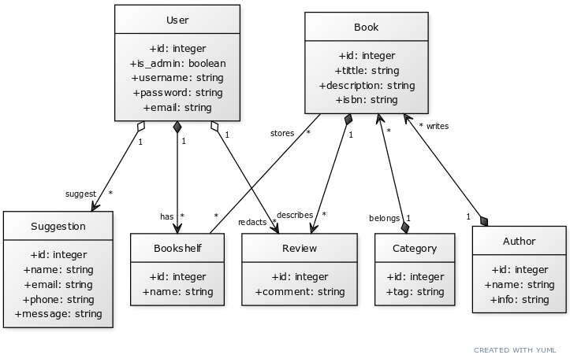

# Proyecto DSS:

## Integrantes del grupo

Miembros:
* Akira Llorens Montero
* Alejando Molines Molina
* Segismundo Ferrairó García
* Ilyas Bsadou

## Especificación inicial del proyecto

### Objetivos

Tenemos como objetivo el desarrollar e implementar una biblioteca online, para la gestión y prestación de libros a usuarios registrados.

La empresa busca suplir la necesidad de tener disponibilidad a un gran amplio catálogo de libros. Se incluirá un gran abanico de ramas y disciplinas (ciencias, historia, documentación, etc) con las que se pretende brindar de conocimiento a sus usarios.
Solo se podrá acceder al contenido de la biblioteca de forma online, pero se dispondrá de una alta disponibilidad y sección destinada a cada usuario logeado.
A la web se podrá acceder con sesión de invitado, pudiendo listar todo el catálogo de libros disponible (sin visualización), pero realmente merece la pena la creación de una cuenta gratuita con el fin de poder no solo acceder al contedio, sino poder clasificar en un nuevo portal todos aquellos documentos guardados por el usuario (favoritos, pendientes, en tendencia)

La funcionalidades básicas que incluirá nuestra aplicación se clasificarán en 3 vistas principales:

* Vista de Administrador

| Funcionalidad | Descripción |
| ------------- | ----------- |
| Añadir/eliminar/modificar libros | El administrador podrá añadir, eliminar o modificar libros |
| Control de Usuarios (Alta/Baja) | El administrador podrá controlar los usuarios registrados |
| Control de Reseñas | El administrador podrá controlar las reseñas de los usuarios |

* Vista de Usuario logueado

| Funcionalidad | Descripción |
| ------------- | ----------- |
| Visualizar el catálogo (Búsqueda, filtrado, guardado) | El usuario podrá visualizar el catálogo completo de libros |
| Crear "estanterías" | Lista de libros creados por el usuario |

* Vista de Usuario invitado

| Funcionalidad | Descripción |
| ------------- | ----------- |
| Visualizar el catálogo (Búsqueda, filtrado) | El usuario podrá visualizar el catálogo completo de libros |
| Acceso a la biblioteca | El usuario invitado podrá acceder a la página de registro o login |

Además están pensadas las siguientes funcionalidades opcionales:

| Funcionalidad | Descripción |
| ------------- | ----------- |
| Compartir documentos | El usuario podrá compartir documentos con otros usuarios |
| Comentar documentos | El usuario podrá comentar documentos |
| Valorar documentos | El usuario podrá valorar documentos |
| Descargar documentos | El usuario podrá descargar documentos |
| Añadir a favoritos | El usuario podrá añadir a favoritos los libros que quiera para acceder más fácilmente |
    

### Descripción 
Como se ha mencionado anteriormente, la web dispondrá de una vista principal mostrando el catálogo completo de documentos almacenados.
Además, si el usuario se registra e inica sesión, dispondrá de un nuevo portal:
* Favoritos: con aquellos documentos que el usuario haya seleccionado
* Pendientes: aquellos documentos que el usario ha empezado a leer
* Trending: aquellos documentos que más han sido marcados como favoritos por otros usuarios

### Público objetivo
Esta página web pública está dirgida a todo aquel que disfrute la lectura o que necesite consultar cualquier tipo de texto.
El apartado de gestión interna está dirigido a los empleados, encargados de añadir y gestionar los materiales disponibles.

### Planificación UML

#### Diagrama de base de datos

#### Diagrama de clases
